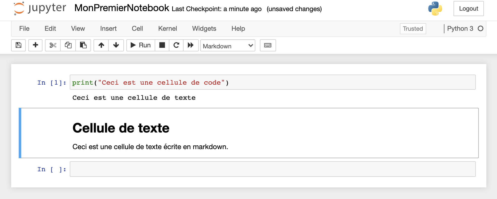

# Jupyter notebook

Manipuler des images en utilisant le langage python avec un éditeur de texte et le terminal implique de jongler avec beaucoup de fenêtres. Pour faciliter interaction avec nos programmes et les données que nous traiterons, nous utiliserons dans cette activité une application web appelée Jupyter Notebook.

Jupyter Notebook nous permettra en effet d'écrire notre programme, de l'exécuter ainsi que de visualiser des données sur une seule page. Mais ce ne'st pas tout: alors que dans un fichier python l'élément de base est une instruction, dans jupyter notebook l'unité de base est une cellule. Une cellule peut être définie dans différents formats: soit elle contient des instructions (cellule de code), soit elle contient du texte en format markdown. 
On pourra ainsi travailler sur un programme tout en l'illustrant pour le rendre plus compréhensible.

!!! note ""
	**Figure 1:** Interface Jupyter notebook avec une cellule de code et une cellule de texte.

Un autre avantage du format en cellules est que chaque cellule peut être exécutée individuellement ce qui est très utile pour débugger et pour ne pas gaspiller de la puissance de calcul.

## Installation

Les instructions détaillées pour isntaller Jupyter Notebooks dépassent le cadre de ce site. Cependant si vous travaillez sur macOS et que python3 est déjà installé alors l'installation et l'exécution se limitera à deux commandes dans le terminal qui sont *pip3 install jupyter* et *jupyter notebook*.

Si vous n'avez pas les droits d'administrateur sur votre ordinateur ou si vous ne souhaitez tout simplemennt pas installer jupyter, alors sachez que vous pouvez utiliser l'outil colab de google qui permet de faire tourner jupyter gratuitement sur leur serveur (en ayant même à disposition des GPUs).

